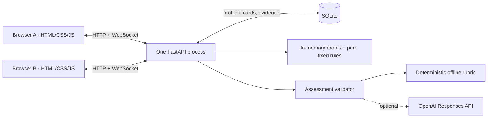

# Neural-Draft

Neural-Draft is a competitive game where real-world decisions become the cards you play. Apply → forge → battle → adapt → forge again. Original authored scenarios and procedural SVG/CSS art. No frontend build, CDN, fonts, image assets, or JavaScript dependencies.

## Run

Python 3.12+ recommended. From this directory:

```powershell
python -m venv .venv
.venv/Scripts/python.exe -m pip install -r requirements.txt
.venv/Scripts/python.exe -m uvicorn app:app --host 127.0.0.1 --port 8000 --ws-max-size 16384
```

Then open [Neural-Draft](http://localhost:8000). On Windows, `./run.ps1` is a convenience launcher; it installs dependencies if it creates a new virtual environment. For two devices on the same network, use `./run.ps1 -ListenAddress 0.0.0.0` and open `http://<server-LAN-IP>:8000` on both. Allow access through the host firewall if required. For Linux/macOS use `.venv/bin/python` in place of `.venv/Scripts/python.exe`.

**Run one server process, without `--reload` or extra workers during the demo.** In-progress rooms live in memory; collections survive restarts in SQLite.

## Two-minute judging route

1. Enter Solo Forge and choose a nickname. Open the three evidence items; ask Leena how to verify the vendor. Her responses are authored and explicitly labelled.
2. Choose **Hold for an independent check**, then select **Source** (Investigate) or **Assumption** (Challenge). Alternatively choose **Quarantine staging first** (Contain) or **Rally a bounded response** (Coordinate). Add one sentence and forge. Show “Forged because you…”, the visible rubric and saved evidence. All three evidence items produce a Luminous theme; evolution never changes power.
3. Open Collection and create a room. On another browser, open **Demo seat B**, then join with the five-character code. The lobby also provides an auto-join link for a second tab.
4. Both players choose an unused card, front and case decision, then lock. Investigate: **Export audit → Evidence**, **A live session → Response**, **Workspace owner → People**. Contain: target the live session. Challenge: challenge the claim that every account was hacked. Coordinate: match the analyst/operator/owner to Evidence/Response/People. Show both revealed choices and server explanations, then both click Next round.
5. After round four, show the result, influential rounds, 2–3 “How you played” observations, and collection. Both players can request a rematch.

**Fastest route:** [Demo A](http://localhost:8000/demo?pilot=A) and [Demo B](http://localhost:8000/demo?pilot=B) open separate profile slots, even in the same browser. They receive explicitly labelled demo cards if they have no collection. These are practice cards, not assessed achievements. There is no bot opponent.

## Four fixed effects

Every card starts at 2 influence. A six-card hand contains one owned card plus five starters; four cards are used across the match.

| Archetype | Fixed effect |
|---|---|
| Investigate | +2 on the selected front if the selected case clue supports that front. |
| Contain | +1 for targeting the live session; another +1 only if the rival contests the chosen front. An irrelevant choice earns neither bonus. |
| Challenge | +1 for challenging the unsupported all-accounts breach claim; another +1 against Investigate or Coordinate. A supported claim earns neither bonus. |
| Coordinate | Match the responder to the front to carry +1 to the next front: Evidence → Response → People → Evidence. No match means no relay. |

Effects resolve simultaneously. Lead two fronts after round four to win, even if the rival has more total influence. If each player leads one front and the third is tied, higher total influence wins. Equal totals, all tied, or just one lead with two tied fronts are draws. No AI-generated mechanics or stats. Total influence per card is bounded at 2–4; evolution adds decorative rings and accents, never power.

## Environment and AI boundary

| Variable | Meaning |
|---|---|
| `OPENAI_API_KEY` | Optional server-side key already provided by your environment. Never sent to the browser. |
| `OPENAI_MODEL` | Optional Responses API model supporting Structured Outputs; default `gpt-4o-mini`. |
| `NEURAL_OFFLINE=1` | Force deterministic assessment even when a key exists. |
| `NEURAL_DB` | Optional SQLite path; defaults to `neural.sqlite3` next to `app.py`. |

No `.env` loader: export variables in the launching shell. With a key, the short reason, selected action, inspected evidence and rubric are sent to the OpenAI Responses API (`store: false`). The schema permits bounded rubric scores, a cited action, feedback, confidence, and four archetypes only. Local validation rejects extra fields, unsupported archetypes, out-of-range values, mismatched citations, and archetypes contradicting the selected action/focus. AI scores cannot exceed the evidence-based rubric ceilings. A network error, invalid result, or eight-second request timeout falls back to deterministic scoring. API integration follows [OpenAI Structured Outputs documentation](https://developers.openai.com/api/docs/guides/structured-outputs).

**Offline is honest:** only selected action, explicit verification focus and opened evidence are scored. The reason is stored and displayed but not interpreted. Rule-match confidence is not a claim about mastery. Leena always uses authored keyword responses; she is not presented as a live LLM. Every player earns a card. Card provenance always uses recorded actions, including in AI mode; it never claims that a selected plan was executed. Four available behaviour patterns require relevant evidence inspection; two clearly locked patterns represent future cases. Older cards retain their original decision record and use the current fixed battle effects. Demo cards unlock no patterns.

## Architecture



`content.py`: authored content and pure game mechanics. `assessment.py`: optional AI and offline rubric. `app.py`: HTTP, private profile tokens, SQLite, room lifecycle and authoritative WebSocket state. `static/`: plain browser UI. Tokens are sent in an HTTP header or first WebSocket message, never in room URLs. Opponent choices are absent from snapshots until both players lock. Round/match IDs prevent stale or duplicate messages from resolving twice. Reconnecting with the same profile restores the seat, hand, scores, and committed move.

## Verification and dependencies

```powershell
.venv/Scripts/python.exe -m unittest discover -s tests -v
node --check static/app.js
# Optional: with the server running, creates two test profiles:
.venv/Scripts/python.exe tests/live_smoke.py
```

Automated tests cover the complete API/WebSocket loop, exhaustive contextual choice/front/opponent combinations, effect bounds and evolution parity, scoring/ties, spoofed choices, grounded provenance and progression, data-supported observations, repeated card reuse, queued simultaneous locks, hidden choices, locked reconnect/rematch, SQLite reopening, and valid/invalid mocked AI responses. Node is only an optional syntax check; the app needs no Node runtime.

Verification for this revision: 16 automated tests and the JavaScript syntax check pass. A separate live HTTP/WebSocket run against Uvicorn passed offline forge, all four contextual effects, wrong-choice denial, hidden locks, four rounds, locked-player disconnect/reconnect, results and rematch. Two independent browser sessions loaded the revised forge and collection, but a Windows browser-tool sandbox startup failure (`apply deny-read ACLs`) blocked the rest of the manual run. The revised full browser loop, refresh mid-match and narrow viewport need a manual rerun. The prior version completed those browser checks; that is not a claim that the changed UI has passed them.

Third-party runtime dependencies: **FastAPI**, **Uvicorn**, **websockets**, and **httpx**, pinned in `requirements.txt`, plus their transitive packages (including Starlette and Pydantic). SQLite, unittest, and other Python helpers are standard library. Browser UI has no third-party dependencies. Starlette currently emits a non-failing deprecation notice for its httpx-based test client.

## Main limitation

This is a trusted local demo, not a public multiplayer service: rooms/results are ephemeral and a server restart requires creating a new room. Nicknames are labels, with browser-held bearer tokens instead of account recovery. Clearing browser storage loses access to that local profile. There is no competitive hardening, automated skill-mastery claim, or rate-limit layer. The live LLM path was not exercised because no credentials were available; validation and fallback were tested with mocked API responses. Card balance is bounded and tested mechanically, but has not had extensive human playtesting.

## Behaviour-to-battle mapping

The selected action and verification focus set the archetype. Inspection affects the visual evolution and pattern discovery, not unrestricted power. Source verification becomes clue relevance; testing approval becomes challenging unsupported claims; targeted isolation becomes identifying live exposure; assigning staff becomes matching a responder to a front. Battle choices are IDs validated against server-owned options. Client-supplied correctness, stats and effects are ignored.

Results describe front coverage and contextual activations, plus a supported switch after losing influence on a front or a successful contested containment. Each observation has cited round numbers and bounded skill tags. They describe implicitly practised decisions, not psychology or certified mastery.

The existing `demo-video/Neural-Draft-demo.mp4` was preserved byte-for-byte. It demonstrates the earlier version, so its wording and effects differ from this revision.
