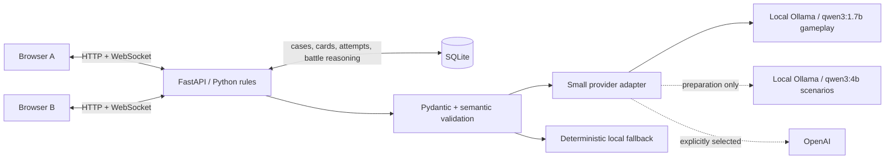

# Neural-Draft

A competitive learning game where the decisions you make become the cards you play. Players face short uncertain situations, write what they would actually do, forge a card from the skill they demonstrated, and use it in a four-round tactical duel.

The aim is simple: **make the game enjoyable first, while useful skills are practised through play.**

**Case → written decision → forge or retry → tactical duel → adapt → new case.** FastAPI, WebSockets, SQLite and plain HTML/CSS/JavaScript. No frontend build, external art, extra SDK or new runtime dependency.

## Run with Ollama

The primary provider is **Ollama** at **http://localhost:11434**. No API key is required. Normal play keeps one small model resident: **qwen3:1.7b** for Forge and Battle. Explicit, offline scenario preparation uses **qwen3:4b**. `OLLAMA_MODEL` remains a backward-compatible override for all tasks.

The final implementation check on 2026-09-30 ran `ollama list`; `qwen3:4b` and the older `qwen3:8b` were present, then the requested `qwen3:1.7b` gameplay model was installed and exercised. The app never downloads models at startup.

For a fresh machine:

```powershell
ollama list
# If either required model is absent:
ollama pull qwen3:4b
ollama pull qwen3:1.7b
ollama run qwen3:1.7b
# Exit the interactive chat with /bye. Keep the Ollama service running.
```

From the neural-draft directory:

```powershell
$env:AI_PROVIDER = "ollama"
$env:OLLAMA_BASE_URL = "http://localhost:11434"
$env:OLLAMA_SCENARIO_MODEL = "qwen3:4b"
$env:OLLAMA_FORGE_MODEL = "qwen3:1.7b"
$env:OLLAMA_BATTLE_MODEL = "qwen3:1.7b"
.\run.ps1
```

Open http://127.0.0.1:8000. `run.ps1` creates `.venv` and installs the pinned requirements if needed. Equivalent command after setup:

```powershell
.venv/Scripts/python.exe -m uvicorn app:app --host 127.0.0.1 --port 8000 --ws-max-size 16384
```

Use one process, without `--reload` or multiple workers. For another device, launch `./run.ps1 -ListenAddress 0.0.0.0` and use the server's LAN address. Linux/macOS use `.venv/bin/python` instead.

## Demo route

1. Open `/?pilot=A&case=demo#forge`. Choose a nickname; the known-good vendor case loads immediately. Open E1, E2 and E3, optionally ask Leena, then write a decision. There are no action-choice buttons.
2. Show the forge result, exact player quotation, saved evidence and rarity. A failed response receives one quick retry; a second failure offers a new case. A partial can mint a Common card.
3. Open Collection, select a card and create a room. Player B can forge independently at `/?pilot=B&case=demo#forge` or use `/demo?pilot=B` for an explicitly unassessed practice issue. Enter the room code.
4. Choose a card and front, read the new case, write one tactical sentence, and seal the move. Both choices remain hidden until both are evaluated. Show a success and a failed ability: even a failure contributes base 2.
5. Complete four rounds. Show the winner, influential rounds, grounded strategy observations and rematch. Return to Collection or Forge again.

New cached case retrieves validated SQLite content immediately and avoids repeating the current case when alternatives exist. **Generate with AI · may take longer** explicitly requests live generation and caches only a validated result. **Demo case** always loads the authored vendor case. These labels distinguish authored cache from AI-generated cache; no authored scenario is presented as a live generation.

Developer walkthrough responses for the known-good vendor case (local heuristics are approximate; live AI may classify differently):

- Straightforward: “I would independently verify the vendor signature through the directory before rollout because the signer changed.”
- Rare opportunity, after opening E1/E2/E3: “I would independently verify the vendor signature in a reversible sandbox before rollout because delay is safer than risking dispatch.”
- Epic opportunity, after opening E1/E2/E3: “I would assign the vendor liaison a signer check and keep manual dispatch running in a reversible pilot; then report back in a handoff before installation because the team needs a stop decision.”
- Fail/retry: submit “potato”, then replace it with a case-grounded action and reason.
- Battle Cross-Reference: “Compare the audit export and live session token because they establish activity but do not prove who used the account; verify the contractor.”
- Battle failure: “I challenge the bad guy.”

## Provider, caching and latency

`providers.py` has two small adapters: Ollama `/api/chat` and optional OpenAI `/v1/responses`. No automatic cross-provider failover sends local text to a cloud service. OpenAI is used only when explicitly selected with a key.

Ollama receives the Pydantic JSON schema through `format`, `stream: false`, `think: false`, temperature 0 and a task-specific generation budget. Responses are validated again in Python. See the official [structured output documentation](https://docs.ollama.com/capabilities/structured-outputs) and [chat API](https://docs.ollama.com/api/chat).

The three prompts are separate: `generate_scenario`, `assess_written`, and `assess_battle`. Forge uses one bounded attempt; Battle may retry once within its short total deadline. Both use `stream: false`, `think: false`, schema-constrained JSON and very small output budgets. Python adds names, flavour, evidence counts, rarity, ability ID, numerical influence and all match results. An unavailable model, invalid output or deadline expiry yields a friendly local-analysis notice, never raw provider errors.

Startup schedules one non-blocking `qwen3:1.7b` warm-up (`Return OK.`), keeps it resident for 30 minutes, and logs elapsed time. Requests log model, completion time, timeout/fallback, cache hits, and explicit live generation. On this laptop the final representative measurements were: cold Forge **6.78s**, warm Forge **2.23s**, warm Battle **1.11s**, and compact validated qwen3:4b scenario generation **26.0s**. Case generation is therefore preparation-only for the main demo.

Six validated authored cases ship in `scenarios.py`: vendor update, conflicting render-farm sensors, a startup release promise, a missing freight scan, confounded lab results, and a two-team release handoff. Three additional qwen3:4b cases were validated and cached in the existing local SQLite database, giving this demo installation **nine** ready cases. Domains are controlled; all cases are fictional. The compact generation schema requests exactly three records, one stakeholder, good/failure signals and Rare/Epic conditions; Python derives IDs, rules, rarity labels, ability templates and the full stored case.

Prepare real AI cases **before** judging, using a larger one-off deadline:

```powershell
.venv/Scripts/python.exe prepare_cases.py --count 10 --timeout 300
# Or target a domain:
.venv/Scripts/python.exe prepare_cases.py --domain cybersecurity --count 2 --timeout 300
```

This writes only validated scenarios into the same SQLite cache. Interactive generation defaults to 45 seconds and can return a cached case. Preparing a case is optional; all six authored cases work without Ollama.

| Variable | Default / purpose |
|---|---|
| `AI_PROVIDER` | `ollama`; optional `openai` |
| `OLLAMA_BASE_URL` | `http://localhost:11434` |
| `OLLAMA_SCENARIO_MODEL` | `OLLAMA_MODEL`, then `qwen3:4b` |
| `OLLAMA_FORGE_MODEL` | `OLLAMA_MODEL`, then `qwen3:1.7b` |
| `OLLAMA_BATTLE_MODEL` | `OLLAMA_MODEL`, then `qwen3:1.7b` |
| `OLLAMA_MODEL` | Optional backward-compatible override for all tasks |
| `NEURAL_OFFLINE` | Set `1` to skip all model calls |
| `SCENARIO_AI_TIMEOUT` | 45 seconds total; preparation supports up to 600 |
| `FORGE_AI_TIMEOUT` | `run.ps1` defaults to 20 seconds; hard maximum 20 (direct server launch defaults to 8) |
| `BATTLE_AI_TIMEOUT` | 3 seconds total; hard maximum 4 |
| `NEURAL_DB` | `neural.sqlite3` beside app.py |
| `OPENAI_API_KEY` | Only for explicitly selected OpenAI provider |
| `OPENAI_MODEL` | Optional alternate-provider model; `gpt-4o-mini` |

No environment variables are strictly required for Ollama defaults or offline play. `.env.example` is documentation; the app does not automatically read `.env` files. Export values in the shell that starts the server.

## Assessment and rarity

Exact schemas are checked in under `docs/`: [scenario](docs/scenario.schema.json), [forge review](docs/forge-review.schema.json), [battle semantic output](docs/battle-semantic.schema.json), and [normalized battle result](docs/battle-result.schema.json).

Synchronous Forge output now contains only: `verdict`, nullable `archetype` (`INVESTIGATE`, `CONTAIN`, `CHALLENGE`, `COORDINATE`), nullable `special_unlock`, `skill`, `forged_because`, and exact `cited_text`. Extra fields are rejected. Python validates the citation, constrains the archetype using explicit response signals, verifies hidden special conditions, derives used evidence, chooses the fixed ability and rarity, and creates the card name/flavour from small archetype banks. The model cannot emit scores, rarity, power, ability IDs, numeric stats or match outcomes.

Player text is untrusted data in every prompt. Outcome-demand/injection patterns cannot unlock a card. Neither model response schema contains arbitrary influence, legal moves or a winner. Scenario ability templates must be one of the eight registered IDs. Hidden rubrics and opportunity conditions never go to the browser.

- **Pass:** good/excellent response mints a card.
- **Partial:** plausible but thin reasoning can mint Common with restrained visuals.
- **Fail:** empty, unrelated, nonsensical, clearly reckless or too vague. No card; concise hints and one retry. Both submissions are stored. Repeating the same request is idempotent, so a network retry does not consume an attempt.
- **Common:** basic or partial pattern.
- **Uncommon:** good/excellent pattern with used evidence.
- **Rare/Epic:** a matching hidden opportunity, at least two opened/used records, its required quoted signals, matching archetype and a non-partial verdict. Epic requires at least four distinctive signals. A high score alone never raises rarity.

Offline analysis uses case tags, explicit action/reason words, reversible-action patterns, evidence inspection and a small injection/recklessness guard. It can misread nuance and negation. It is labelled **approximate local analysis**, not a claim of semantic comprehension or mastery. Character replies route the question to stored case facts and are labelled authored routing.

## Complete approved ability library

Every play always contributes **2 base influence**. Failure adds zero bonus. Partial adds 1. Success has at most 2 bonus influence, or 1 bonus plus 1 conditional cancellation. Rarity itself never changes a rule or number. “Next” means Evidence → Response → People → Evidence.

| ID | Ability | Success | Partial |
|---|---|---|---|
| `INVESTIGATE_VERIFY` | Verify | +2 on chosen front | +1 here |
| `CONTAIN_ISOLATE` | Isolate | +1 here; another +1 if rival contests here | +1 here |
| `CHALLENGE_COUNTERCLAIM` | Counterclaim | +1 here; another +1 against Investigate/Coordinate | +1 here |
| `COORDINATE_RALLY` | Rally | +1 here and +1 next | +1 next |
| `INVESTIGATE_CROSSCHECK` | Cross-Reference | +1 here and +1 on own weakest other front | +1 here |
| `CONTAIN_STABILISE` | Stabilise | +2 here if contested; otherwise +1 here and +1 next | +1 here |
| `CHALLENGE_FALSE_PREMISE` | False Premise | +1 here; cancel at most 1 rival bonus | +1 here |
| `COORDINATE_DUAL_CHANNEL` | Dual Channel | +1 on each other front | +1 next |

Weakest-front ties use Evidence/Response/People order. False Premise removes only a pre-existing conditional bonus in that same fixed order, never base influence; two cancellations resolve simultaneously. Variants trade placement and execution conditions rather than greater raw budgets. The bounded mechanics still need human balance playtesting.

Four rounds, three fronts, one owned card plus five starters. Each card can be used once. Lead two fronts to win. If each player leads one and the third ties, total influence breaks the split; otherwise draw. Server-owned room locks seal a move before evaluation begins; asynchronous model work runs outside the room lock. Reconnect restores even a pending sealed move. Only both completed evaluations reveal the plays.

Results derive 2–3 observations from recorded front coverage, successful reasoning abilities, a supported front switch after losing influence, or a successful contested containment. Round references and skill tags support the statements; no personality or clinical claims.

## Persistence and architecture

Additive SQLite evolution retains existing profiles and cards. `attempts` gains scenario ID, response, latest assessment, retry count and status. New tables: `scenarios`, `forge_submissions` (both attempts and their assessments), and `battle_reasoning` (room/match/round/player, prompt, response, assessment, ability ID). Cards remain JSON payloads with rarity, ability, domain, scenario origin, timestamp and full provenance. Legacy cards receive current fixed ability metadata when read; original evidence is preserved.



Changed/new runtime files: `app.py`, `abilities.py`, `scenarios.py`, `reasoning.py`, `providers.py`, `prepare_cases.py`, `content.py`, `static/app.js`, `static/style.css`. Documentation/config: README, `.env.example`, exact JSON schemas. Tests: updated `test_app.py` and `live_smoke.py`; added `test_written.py` and `render_smoke.cjs`. `assessment.py` and original content mechanics remain for legacy regression coverage; the active written flow uses `reasoning.py` and `providers.py`.

## Verification

```powershell
.venv/Scripts/python.exe -m unittest discover -s tests -v
node --check static/app.js
# With a running server; creates two test profiles and plays a full duel:
.venv/Scripts/python.exe tests/live_smoke.py http://127.0.0.1:8000
```

Thirty-one automated tests pass, including task-specific model routing, compact Forge schema rejection, generation schema rejection, provider JSON schema requests, no-key/unavailable-model fallback, hidden conditions, real fail/retry, grounded citations, rarity independence, exhaustive ability budgets, simultaneous cancellation, hidden commitments, queued simultaneous moves, reconnect, rematch, persistence and legacy schema migration. Pure frontend template smoke checks also pass; they do not verify browser layout.

An isolated no-AI live server passed two written forges (Rare/Epic), four rounds, successful and failed abilities, base retention, hidden moves, locked-seat reconnect, results and rematch. Real qwen3:1.7b structured calls passed the final Forge and Battle validation paths, while qwen3:4b produced two validated cached cases. The same full wire-level match remains covered with AI unavailable, so model failure cannot stall multiplayer.

**Browser limitation:** the computer-use tool still fails at startup with a Windows sandbox ACL error. A full revised two-browser walkthrough and mobile visual verification could not be completed; backend and template checks are not substitutes for that manual check.

Runtime dependencies remain FastAPI, Uvicorn, websockets, httpx and their pinned transitive dependencies (Starlette/Pydantic). SQLite/unittest are standard library. No Ollama Python package is required. Node is optional for syntax/template tests only. Starlette emits a non-failing httpx test-client deprecation notice.

## Demo risks

Do not run qwen3:4b preparation during a live match: it can evict the resident gameplay model and increase first-turn latency. The 1.7B model is fast enough once warm but less semantically reliable than 8B; exact citations, schema validation and server-side signal constraints catch observed mistakes, then local analysis takes over. The transparent local evaluator can miss valid paraphrases. Rooms are in memory and disappear on server restart; cards/cases/provenance persist. Browser profiles are bearer tokens, not recoverable accounts. This is a trusted local hackathon prototype, not a hardened public service.

The existing `demo-video/Neural-Draft-demo.mp4` is unchanged. It records the older interface and rules.
